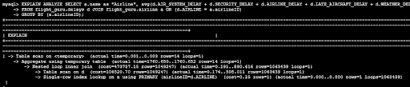
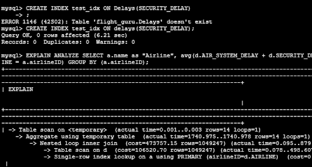
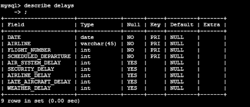
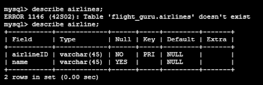
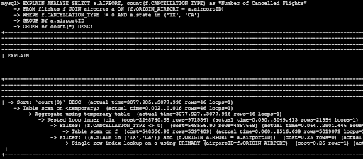
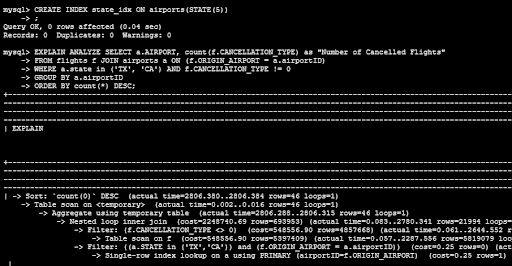
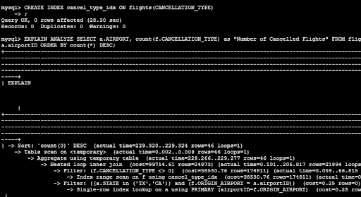
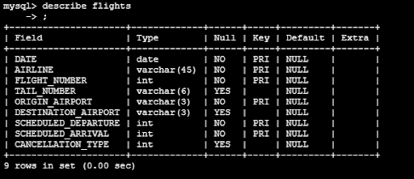
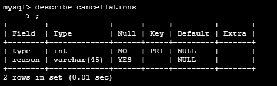

## DDL
```
CREATE TABLE `airline` (
  `airlineID` varchar(45) NOT NULL,
  `name` varchar(45) DEFAULT NULL,
  PRIMARY KEY (`airlineID`)
) ENGINE=InnoDB DEFAULT CHARSET=utf8mb3
```
```
CREATE TABLE `airports` (
  `airportID` varchar(45) NOT NULL,
  `AIRPORT` varchar(45) DEFAULT NULL,
  `CITY` varchar(45) DEFAULT NULL,
  `STATE` varchar(45) DEFAULT NULL,
  `COUNTRY` varchar(45) DEFAULT NULL,
  `LATITUDE` double DEFAULT NULL,
  `LONGITUDE` double DEFAULT NULL,
  PRIMARY KEY (`airportID`)
) ENGINE=InnoDB DEFAULT CHARSET=utf8mb3
```
```
CREATE TABLE `cancellations` (
  `type` int NOT NULL,
  `reason` varchar(45) DEFAULT NULL,
  PRIMARY KEY (`type`)
) ENGINE=InnoDB DEFAULT CHARSET=utf8mb3
```
```
CREATE TABLE `delays` (
  `DATE` date NOT NULL,
  `AIRLINE` varchar(45) NOT NULL,
  `FLIGHT_NUMBER` int NOT NULL,
  `SCHEDULED_DEPARTURE` int NOT NULL,
  `AIR_SYSTEM_DELAY` int DEFAULT NULL,
  `SECURITY_DELAY` int DEFAULT NULL,
  `AIRLINE_DELAY` int DEFAULT NULL,
  `LATE_AIRCRAFT_DELAY` int DEFAULT NULL,
  `WEATHER_DELAY` int DEFAULT NULL,
  PRIMARY KEY (`DATE`,`AIRLINE`,`FLIGHT_NUMBER`,`SCHEDULED_DEPARTURE`)
) ENGINE=InnoDB DEFAULT CHARSET=utf8mb3
```
```
CREATE TABLE `flights` (
  `DATE` date NOT NULL,
  `AIRLINE` varchar(45) NOT NULL,
  `FLIGHT_NUMBER` int NOT NULL,
  `TAIL_NUMBER` varchar(6) DEFAULT NULL,
  `ORIGIN_AIRPORT` varchar(3) NOT NULL,
  `DESTINATION_AIRPORT` varchar(3) DEFAULT NULL,
  `SCHEDULED_DEPARTURE` int NOT NULL,
  `SCHEDULED_ARRIVAL` int NOT NULL,
  `CANCELLATION_TYPE` int DEFAULT NULL,
  PRIMARY KEY (`DATE`,`AIRLINE`,`FLIGHT_NUMBER`,`ORIGIN_AIRPORT`,`SCHEDULED_DEPARTURE`,`SCHEDULED_ARRIVAL`),
  KEY `AIRLINE_idx` (`AIRLINE`)
) ENGINE=InnoDB DEFAULT CHARSET=utf8mb3
```
```
CREATE TABLE `planes` (
  `AIRLINE` varchar(45) NOT NULL,
  `TAIL_NUMBER` varchar(45) NOT NULL,
  PRIMARY KEY (`AIRLINE`,`TAIL_NUMBER`),
  CONSTRAINT `AIRLINE` FOREIGN KEY (`AIRLINE`) REFERENCES `airline` (`airlineID`) ON DELETE CASCADE ON UPDATE CASCADE
) ENGINE=InnoDB DEFAULT CHARSET=utf8mb3
```
## Adding Data to Tables
Only displaying the tables with over 1000 rows:


## Advanced Queries

Total Number of Cancelled Flights for Each Airport:


Average Delay Time for Each Airline


This has less than 15 rows because there are less than 15 airlines in the dataset!

## Explain Analyze
### Average Delay Time for Each Airline



The cost for the join, as expected, was very expensive. Same for the table scan. So we will prioritize those. For this type of query, we should be looking at speeding up the join condition and the group by clause. However, when we look at the tables, we see the fields used are already primary keys and so they have indexes already. 
I’ve tried creating an index for the aggregated columns but this has caused no change to the cost of the operations, as expected since we are just aggregating, not doing any lookups; the same happens if we create an index for airline names, for the same reason. It seems there is no way to speed up this type of query unless we were to change the way our tables are connected, to avoid the join of this huge table.







### Total Number of Canceled Flights for Each Airport located in a list of states:



Here we see the most costly operations are the JOINS which happen on origin airportID, the filtering on cancellation type in the flights table and the table scan for searching for airports in a specific set of states, so our aim in creating indexes will focus on improving these operations. 

First I tried to speed up the query’s scan in states by setting an ID for airport state. This didn’t work, thought it might be because there are still non-indexed columns being used in that search.



After I created an index for CANCELLATION_TYPE the index lookup seems to be happening properly for both indexes. Upon inspection it seems the index created for cancellation type has decreased the cost as expected, but the state index did not decrease cost. This might be because the state lookup is just a check for a value in a list the user provides, so more or less this is a constant operation.






